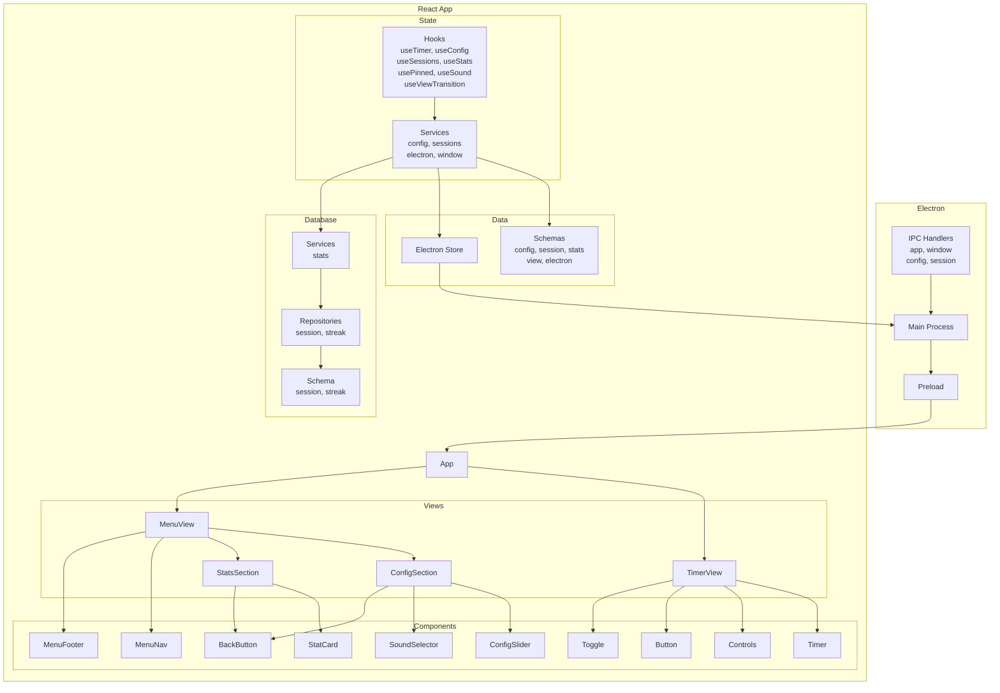

<div align="center">
  

  <h1>Hollow</h1>

  <p><strong>Un temporizador Pomodoro minimalista para escritorio</strong></p>

  <p>
    <em>Enfócate en lo importante. El tiempo fluye.</em>
  </p>

  <p>
    <a href="https://electronjs.org">
      
    </a>
    <a href="https://react.dev">
      
    </a>
    <a href="https://www.typescriptlang.org">
      
    </a>
    <a href="https://bun.sh">
      
    </a>
    <a href="https://codecov.io/gh/torrescereno/hollow">
      
    </a>
  </p>

  <p>
    <a href="#features">Características</a> •
    <a href="#tech-stack">Tech Stack</a> •
    <a href="#architecture">Arquitectura</a> •
    <a href="#instalación">Instalación</a>
  </p>
</div>

---

## ✨ Características

| ⏱️ **Timer Inteligente**                      | 📊 **Estadísticas Detalladas**          |
| :-------------------------------------------- | :-------------------------------------- |
| Intervalos personalizables de focus y break   | Historial completo de sesiones y rachas |
| **⚙️ Configuración Flexible**                 | **💾 Storage Local**                    |
| Duración, sonidos y comportamiento de ventana | Datos privados, sin conexión a internet |

---

## 🛠️ Tech Stack

### Frontend

| Tecnología          | Propósito       |
| ------------------- | --------------- |
| **React 19**        | Framework UI    |
| **TypeScript**      | Tipado estático |
| **Tailwind CSS v4** | Estilos         |
| **Motion**          | Animaciones     |
| **Lucide React**    | Iconos          |

### Desktop

| Tecnología         | Propósito                     |
| ------------------ | ----------------------------- |
| **Electron 33**    | Framework de escritorio       |
| **Electron Store** | Persistencia de configuración |

### Build

| Herramienta          | Propósito       |
| -------------------- | --------------- |
| **Vite**             | Build tool      |
| **Bun**              | Package manager |
| **Electron Builder** | Empaquetado     |

---

## 🏗️ Arquitectura

Hollow sigue una **arquitectura en capas** con separación clara de responsabilidades:

### System Overview



### Resumen de Capas

| Capa           | Responsabilidad                    | Tecnologías                 |
| -------------- | ---------------------------------- | --------------------------- |
| **Views**      | UI y presentación                  | React, TypeScript           |
| **Components** | Primitivos UI reutilizables        | React                       |
| **State**      | Lógica de negocio y flujo de datos | Custom Hooks                |
| **Services**   | Integraciones externas             | Electron API                |
| **Data**       | Persistencia y esquemas            | Electron Store, Zod         |
| **Database**   | Almacenamiento estructurado        | Better-SQLite3, Drizzle ORM |

---

## 📸 Screenshots

<div align="center">

> **🖼️ Próximamente:** Capturas de pantalla de la aplicación

|  Timer View   |   Menu View   |
| :-----------: | :-----------: |
| _Placeholder_ | _Placeholder_ |

|  Config View  |  Stats View   |
| :-----------: | :-----------: |
| _Placeholder_ | _Placeholder_ |

</div>

---

## 🚀 Instalación

### Prerrequisitos

- **Node.js** >= 18.x
- **Bun** >= 1.0 (recomendado) o npm

### Quick Start

```bash
# Clonar el repositorio
git clone https://github.com/torrescereno/hollow.git
cd hollow

# Instalar dependencias
bun install

# Ejecutar en modo desarrollo
bun run dev
```

### Build para Producción

```bash
# Build para el SO actual
bun run build

# Builds específicos por plataforma
bun run build:win    # Windows (.exe)
bun run build:mac    # macOS (.dmg)
bun run build:linux  # Linux (.AppImage, .deb)
```

<details>
<summary><b>📖 Scripts de Desarrollo</b></summary>

| Comando               | Descripción                             |
| --------------------- | --------------------------------------- |
| `bun run dev`         | Servidor de desarrollo con hot reload   |
| `bun run build`       | Build para producción (auto-detecta OS) |
| `bun run build:win`   | Build para Windows (.exe)               |
| `bun run build:mac`   | Build para macOS (.dmg)                 |
| `bun run build:linux` | Build para Linux (.AppImage, .deb)      |

</details>

---

<div align="center">
  <sub>Hecho con ❤️ por <a href="https://github.com/torrescereno">torrescereno</a></sub>
</div>
